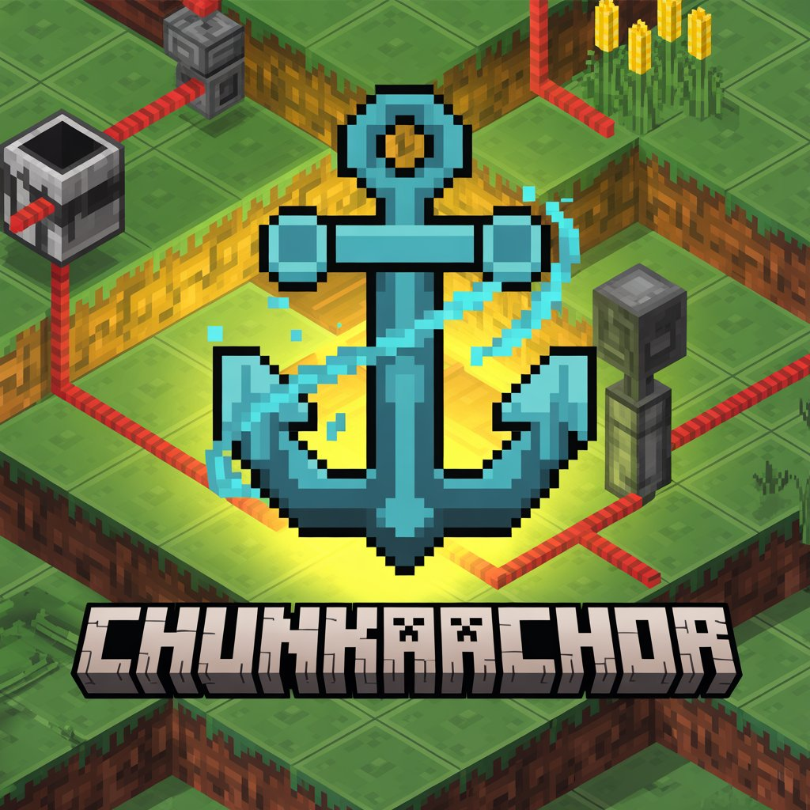

<p align="center">
  
</p>

# ChunkAnchor

A Paper plugin that keeps chunks loaded when players are online - perfect for automated farms and redstone contraptions.

## Features

- **Simple Commands**: Create named anchors with `/chunkanchor add <name>`
- **Per-Player Namespaces**: Each player manages their own anchors independently
- **Configurable Area**: Default loads 7x7 chunks (49 chunks) per anchor
- **Visual Boundaries**: See exactly which chunks are loaded with particle effects
- **Load Modes**: Choose between ALWAYS (24/7) or PLAYER_ONLINE loading per anchor
- **Enable/Disable**: Temporarily disable anchors without deleting them
- **Persistent Storage**: Anchors survive server restarts
- **Performance Friendly**: Uses Paper's chunk ticket API for proper chunk ticking

## Commands

| Command | Description | Permission |
|---------|-------------|------------|
| `/chunkanchor add <name>` | Create anchor at your current location | `chunkanchor.use` |
| `/chunkanchor remove <name>` | Remove an anchor by name | `chunkanchor.use` |
| `/chunkanchor list` | List all your anchors with status | `chunkanchor.use` |
| `/chunkanchor show <name>` | Visualize anchor boundaries for 30 seconds | `chunkanchor.use` |
| `/chunkanchor mode <name> <mode>` | Set load mode (DEFAULT/ALWAYS/PLAYER_ONLINE) | `chunkanchor.use` |
| `/chunkanchor enable <name>` | Enable a disabled anchor | `chunkanchor.use` |
| `/chunkanchor disable <name>` | Disable an anchor (doesn't count toward limit) | `chunkanchor.use` |

**Alias**: `/ca`

## Permissions

| Permission | Description | Default |
|------------|-------------|---------|
| `chunkanchor.use` | Access to all chunk anchor commands | op |

## Behavior

### How It Works

1. **Anchor Creation**: Stand where you want chunks loaded and run `/chunkanchor add farm`
2. **Area Loading**: The plugin loads a configurable radius of chunks around the anchor point
3. **Activation**: Depends on load mode:
   - **PLAYER_ONLINE**: Chunks load when first player joins, unload when last player leaves
   - **ALWAYS**: Chunks load at server startup and stay loaded 24/7

### Load Modes

| Mode | Description |
|------|-------------|
| `DEFAULT` | Uses server's `default-load-mode` from config |
| `ALWAYS` | Chunks stay loaded even when no players are online |
| `PLAYER_ONLINE` | Chunks only load when at least one player is online |

### Enable/Disable

- Disabled anchors don't load chunks and don't count toward your anchor limit
- Useful for temporarily pausing farms without losing the anchor location
- Re-enabling checks the limit - you can't enable if you're already at max active anchors

### Chunk Loading

- Uses Paper's `addPluginChunkTicket()` API for proper chunk ticking
- Loaded chunks behave as if a player is nearby:
  - Redstone circuits operate
  - Crops grow
  - Furnaces smelt
  - Mob spawning works (within spawn limits)

### Visualization

Run `/chunkanchor show <name>` to see:
- **Corner Pillars**: 4 vertical particle columns at the outer corners
- **Ground Outline**: Particles tracing the perimeter at ground level
- Particles last 30 seconds (configurable)

## Configuration

### config.yml

```yaml
# Maximum anchors per player
default-limit: 3

# Chunk radius around anchor point
# 3 = 7x7 chunks (49 total)
# 4 = 9x9 chunks (81 total)
chunk-radius: 3

# Visualization duration in seconds
show-duration: 30

# Default load mode for new anchors
# ALWAYS - chunks are loaded even when no players are online
# PLAYER_ONLINE - chunks are only loaded when at least one player is online
default-load-mode: PLAYER_ONLINE
```

### anchors.yml

Anchor data is stored in `plugins/ChunkAnchor/anchors.yml`:

```yaml
players:
  550e8400-e29b-41d4-a716-446655440000:
    farm:
      world: world
      x: 100
      z: -200
      load-mode: ALWAYS
      enabled: true
    base:
      world: world
      x: 0
      z: 0
      load-mode: DEFAULT
      enabled: false
```

## Installation

### Download

- **Latest Release**: https://s3.psalkowski.pl/minecraft-plugins/chunk-anchor/ChunkAnchor.jar
- **Snapshot (dev)**: https://s3.psalkowski.pl/minecraft-plugins/chunk-anchor/ChunkAnchor-SNAPSHOT.jar
- **GitHub Releases**: https://github.com/HomeCraftMC/chunk-anchor/releases
- **Modrinth**: https://modrinth.com/plugin/chunkanchor

### Steps

1. Download `ChunkAnchor.jar`
2. Place in your server's `plugins/` folder
3. Restart the server
4. Use `/chunkanchor add <name>` to create your first anchor

## Compatibility

| Plugin Version | Minecraft | Paper | Java |
|----------------|-----------|-------|------|
| 1.0.x          | 1.21.4    | 1.21  | 21+  |

**Server Software**: Paper or Paper-based forks (Purpur, Pufferfish, etc.)

## Building from Source

```bash
mvn clean package
```

Output: `target/ChunkAnchor-<version>.jar`

## CI/CD

Builds are automated via Woodpecker CI:
- **Push to main**: Builds and uploads `ChunkAnchor-SNAPSHOT.jar` to S3
- **Tag `vX.Y.Z`**: Builds release and:
  - Uploads to S3: `ChunkAnchor.jar` (latest) + `ChunkAnchor-X.Y.Z.jar`
  - Creates GitHub Release with JAR attached

## License

MIT
